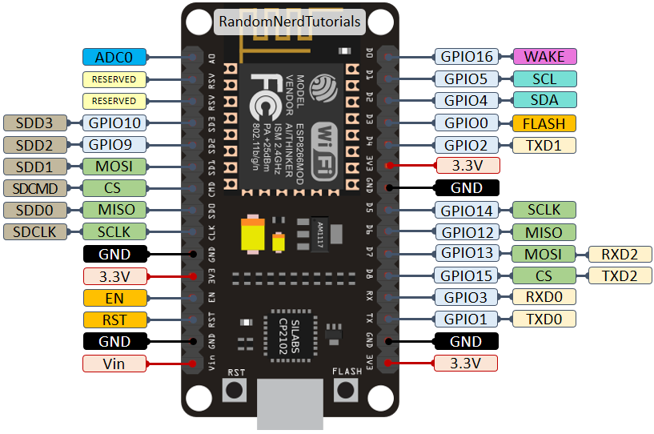

# About Workshop
Department of Electronics and Communication Engineering (ECE) from Narasaraopeta Engineering College (NEC) is jointly organising a 3-day workshop on Industrail Internet of Things (IIoT) from the dates of 17th - 19th July 2023.

# About the Speaker

Madhu Parvathaneni alias MS is a Solutions Architect and CEO at Make Skilled. He has 10+ years of experience in building IoT products from prototype stage to production stage. He trained more than 1.8 lakh students and 10K+ faculties across India on various cutting-edge technologies like IoT, Machine Learning, Cloud Computing, Augmented and Virtual Reality, Robotics, Blockchain etc...

# Pinout

# Table of Contents

<table>
  <tr>
    <th>S.No</th>
    <th>Day</th>
    <th>Name of Activity</th>
  </tr>
  <tr>
    <td>1</td>
    <td>Day 1</td>
    <td>Introduction to IIoT</td>
  </tr>
  <tr>
    <td>2</td>
    <td>Day 1</td>
    <td>Introduction to ESP8266</td>
  </tr>
  <tr>
    <td>3</td>
    <td>Day 1</td>
    <td>Introduction to Arduino</td>
  </tr>
  <tr>
    <td>4</td>
    <td>Day 1</td>
    <td>ESP8266 Configuration in Arduino IDE</td>
  </tr>
  <tr>
    <td>5</td>
    <td>Day 1</td>
    <td>Create Hello Madhu Program</td>
  </tr>
</table>

# WhatsApp Group
<a href="https://chat.whatsapp.com/I46BKtu8jkiCclyGoyq9Ja">Click Here to Join the Group</a>

# For questions
Do reach me on <a href="https://linkedin.com/in/MadhuPIoT">LinkedIn</a>

